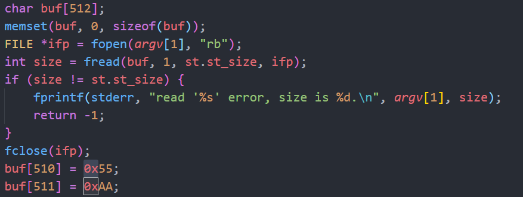
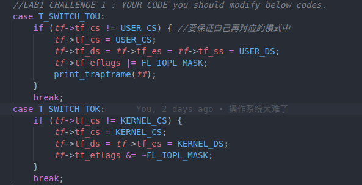
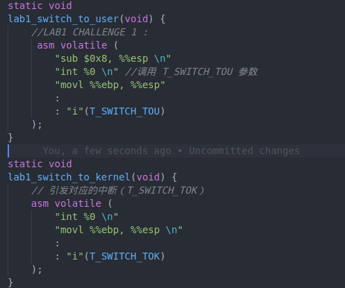
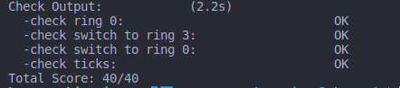

## 操作系统实验Lab1——系统软件启动过程

###### 孙天琦和孙天琦的男妈妈们

 ### 练习一 通过make生成执行文件的过程

1. 操作系统镜像文件ucore.img的分析过程

   首先我们需要找到创建ucore.img的makefile代码

   

   将ucore.img传入totarget表达式调用call函数结果赋值给UCOREIMG变量，然后UCOREIMG作为target，其首先依赖于kernel和bootblock两个文件，接下来是make的指令。首先从/dev/zero（/dev/zero是类UNIX系统中的一个特殊的组件，如果你读它，它会提供给你无限的空字符）中读取了10000个块的文件，每个块默认用0填充的512字节，生成空文件，接着将bootblock中的内容写到第一个块中，将kernel的内容写到第二个块中

   不难发现，如果生成ucore.img需要首先生成kernel和bootblock，因此我们需要观察kernel和bootblock

   查看kernel的makefile代码

   

   kernel的生成依赖于KOBJS和tools/kernel.ld，第五行链接各种文件输出给目标文件，第六行反汇编输出给asmfile这个变量，第七行输出目标文件的行号并进行文本替换，最后写入symfile这个变量

   使用make V= > build.log 2>&1将makefile的过程具体输出到日志文件build.log中（过长未截全）

   

   

   ld命令根据链接脚本文件kernel.ld将生成的*.o文件，链接成BIN目录下的kernel文件；-m指定特定的链接器，-T指定文件名，-o指定输出文件的名称

   生成kernel需要很多文件，生成这些文件的makefile为下列的批处理代码

   	

   实际代码为，以init.o为例

   

   -fno-bultin 除非用builtin前缀，否则不进行builtin优化

   -ggdb 尽可能的生成gdb可用的调试信息

   -m32 生成适用于32位的代码

   -gstabs 以stabs格式生成调试信息，但是不包括gdb

   -nostdinc 使得编译器不在系统缺省的头文件目录中找头文件

   -fno-stack-protector 不生成用于检测缓冲区溢出的代码

   -I<dir> 添加搜索头文件的路径

   查看bootblock的makefile代码

   

   bootblock依赖于bootasm.o，bootmain.o，sign，生成的编译指令为

   

   -N 设置代码段和数据段均可读写

   -e 指定入口为start

   -Ttext 指定代码段开始位置为0x7C00

   bootasm.o和bootmain.o由makefile中第一行和第二行可以生成，实际代码为

   

   查看sign的makefile代码

   

   

2. 一个被系统认为是符合规范的硬盘主引导扇区的特征

   

   主引导扇区中共有512个字节，其中第511个写入0x55，第512个写入0xAA

### 练习二 使用qemu执行并调试lab1中的软件

1. 从CPU加电后执行的第一条指令开始，单步跟踪BIOS的执行

   在makefile中找到debug的命令

   

   这三行指令分别执行：

   1. 使用qemu运行一个32位程序的虚拟机，qemu在上面已经赋值过，使用到的一些变量的定义分别为：-S 在启动时不启动CPU，需要在monitor中输入c，才能让qemu继续模拟工作；-s等待gdb连接到端口1234；-hda $<，使用$<作为硬盘0 1 2 3镜像，其中$<是第一个依赖，也就是$(UCOREIMG)；-parallel stdio：重定向虚拟并口到主机设备studio中；-serial null；不重定向虚拟串口到主机设备

      

   2. sleep 2：程序休眠两秒

   3. 以gdb的方式，打开一个终端，其中使用tools/gdbinit作为初始化配置

   4. 总而言之就是启动qemu、启动terminal并运行gdb，因此我们可以修改debug代码，即在调试时增加-d in_asm -D q.log参数，将运行的汇编执行保存在/bin/q.log中

      

   修改tools/gdbinit内容为下，同时删除continue，为了防止qemu在gdb连接后立即开始执行，加入钩子，也就是gdb每次停止的时候会执行中间的语句，因为我的虚拟机中好像不太成功，所以查阅附录得到执行位置是由pc和cs寄存器计算得来，所以构造钩子

   

   make debug得到结果

   

   发现CPU加电后第一条指令为ljmp的长跳转指令，也就是说第一条指令就是0xfe05b位置的指令，si单步执行后得到下一条指令为

   

2. 在初始化位置0x7c00设置实地址断点，测试断电正常

   输入 b *0x7c00设定实地址断电，c执行，然后x /10i $pc输出10句汇编，说明断点正常（我也不知道为啥到了这里pc就能用了，离谱）

   

3. 从0x7c00开始跟踪代码运行，将单步跟踪反汇编得到的代码与bootasm.S和bootblock.asm进行比较

   bootasm.S和bootblock.asm代码基本上完全相同，主要功能就是初始化数据段、额外段、栈区等；进行与早期PC兼容的操作，如果地址线超过总线长，高位清零；从实模式切换到保护模式，使得物理地址表示转换为虚拟地址表示

4. 自己找一个bootloader或内核中的代码位置，设置断点并进行测试

   不妨把断点放到bootmain 0x7d11上，然后可以si单步查看汇编代码

   

   

5. 坑！坑！

   1. 第一小题中debug需要图形化界面，因此无法使用WSL配合VSCODE进行编程，这样的Ubuntu没有图形化界面，需要在VM的虚拟机上进行操作
   2. 灵异事件，当我进入到gdb后，x /2i $pc 并无法显示当前的汇编指令（一个长跳转），但是当我下断点之后，再用pc去看，他就能输出了，所以在执行第一条指令时我用pc和cs寄存器计算输出当前的指令 x /i (($cs << 4) + $pc)
   3. 

### 练习三 分析bootloader进入保护模式的过程


​		bootloader的首要任务是启动保护模式。通过这个练习可以了解到如何开启A20;CPU是如何从实模式转换到保护模式;如何初始化和使用GDT表的。通过分析boot/bootasm.S，我们可以具体看到整个过程。

##### 1. 关闭中断，将各个段寄存器重置：

```asm
#include <asm.h>		# asm.h 包含许多的宏定义，包括常量和“函数”（应该是地址转换的函数）。

# Start the CPU: switch to 32-bit protected mode, jump into C.
# The BIOS loads this code from the first sector of the hard disk into
# memory at physical address 0x7c00 and starts executing in real mode
# with %cs=0 %ip=7c00.


# 内核代码段段地址[段选择器]
.set PROT_MODE_CSEG,        0x8                     # kernel code segment selector
# 内核Data段段地址[段选择器]
.set PROT_MODE_DSEG,        0x10                    # kernel data segment selector
# 保护模式的flag
.set CR0_PE_ON,             0x1                     # protected mode enable flag

# start address should be 0:7c00, in real mode, the beginning address of the running bootloader
.globl start
start:
# 在16位模式下，首先关闭中断
.code16                                             # Assemble for 16-bit mode
    cli                                             # Disable interrupts
    cld                                             # String operations increment
    
    # 将各个段寄存器置0
     # Set up the important data segment registers (DS, ES, SS).
    xorw %ax, %ax                                   # Segment number zero
    movw %ax, %ds                                   # -> Data Segment
    movw %ax, %es                                   # -> Extra Segment
    movw %ax, %ss                                   # -> Stack Segment
```

##### 2. 开启/关闭A20：

> ​	i8086的CPU数据总线是16bit，地址总线是20bit，寄存器是16bit，CPU只能访问1MB以内的空间，数据总线和寄存器只有16bit，想要获取20bit的数据，需要做一些额外的操作如移位，CPU通过对segment(大小恒为64K)进行移位后和offset一起组成20bit的地址，这个地址就是实模式下访问内存的地址。20bit的地址理论可以访问1MB的内存空间，这在i8086中是没有问题的，但是到了i80386，CPU有了更宽的地址总线，数据总线和寄存器后，在实模式下，我们可以访问超过1MB的空间，但我们只希望访问到1MB的空间，因此CPU添加了一个可控制A20地址线模块，通过该模块，在实模式下将第20bit的地址线限制为0，进入保护模式后，再通过这个模块解除对A20地址线的限制，这样就又能访问超过1MB的内存空间了。

​		然后将A20置1，使得全部32条地址线可用：

```asm
    # Enable A20:
    #  For backwards compatibility with the earliest PCs, physical
    #  address line 20 is tied low, so that addresses higher than
    #  1MB wrap around to zero by default. This code undoes this.

#启用A20
seta20.1:
#等待键盘缓冲区为空，再给键盘发信号
    inb $0x64, %al           # Wait for not busy(8042 input buffer empty).
    testb $0x2, %al          # 如果 %al 第低2位为1，则ZF = 0, 则跳转
    jnz seta20.1             # 如果 %al 第低2位为0，则ZF = 1, 则不跳转

#向0x64端口发送指令，告诉它要写它的p2
    movb $0xd1, %al          # 0xd1 -> port 0x64
    outb %al, $0x64          # 0xd1 means: write data to 8042's P2 port

seta20.2:
    inb $0x64, %al           # Wait for not busy(8042 input buffer empty).
    testb $0x2, %al
    jnz seta20.2

#在键盘不忙的时候（检查键盘的status register)，写键盘的input buffer，将A20置为高电平
	movb $0xdf, %al             # 0xdf -> port 0x60
    outb %al, $0x60          # 0xdf = 11011111, means set P2's A20 bit(the 1 bit) to 1
```

##### 3. 加载GDT表：

​		GDT全称Global Descriptor Table，全局描述表，在保护模式下，为了更好地管理4G的可寻址（物理地址）空间，采用了分段存储管理机制，以支持存储共享、保护、虚拟存储等。每个段以起始地址和长度限制表示（它还包含一些属性，如粒度、类型、特权级、存在位、已访问位）。分段地址转换是需要访问它，取段基址。像是data segment，code segment，就是由此管理。

```asm
    # 全局描述符表：存放8字节的段描述符，段描述符包含段的属性。
    # 段选择符：总共16位，高13位用作全局描述符表中的索引位，GDT的第一项总是设为0，
    #   因此孔断选择符的逻辑地址会被认为是无效的，从而引起一个处理器异常。GDT表项
    #   最大数目是8191个，即2^13 - 1.
    # Switch from real to protected mode, using a bootstrap GDT
    # and segment translation that makes virtual addresses
    # identical to physical addresses, so that the
    # effective memory map does not change during the switch.
    lgdt gdtdesc
```

​		在进入保护模式下需要使用分段的内存空间，因此在进入保护模式前，需要初始化GDT，如下是GDT初始化代码：

```asm
#define #define SEG_NULLASM                                             \
    .word 0, 0;                                                 \
    .byte 0, 0, 0, 0

#define SEG_ASM(type,base,lim)                                  \
    .word (((lim) >> 12) & 0xffff), ((base) & 0xffff);          \
    .byte (((base) >> 16) & 0xff), (0x90 | (type)),             \
        (0xC0 | (((lim) >> 28) & 0xf)), (((base) >> 24) & 0xff)

gdt:
    /* 有一个特殊的选择子称为空(Null)选择子，它的Index=0，TI=0，而RP
    L字段可以为任意值。空选择子有特定的用途，当用空选择子进行存储访
    问时会引起异常。空选择子是特别定义的，它不对应于全局描述符表GDT
    中的第0个描述符，因此处理器中的第0个描述符总不被处理器访问，一
    般把它置成全0。*/
    SEG_NULLASM                                     # null seg
    
    /* 在Lab1中, code segment和data segment都可以访问整个内存空间 */
    SEG_ASM(STA_X|STA_R, 0x0, 0xffffffff)           # code seg for bootloader and kernel
    SEG_ASM(STA_W, 0x0, 0xffffffff)                 # data seg for bootloader and kernel

gdtdesc:
    /* lgdt 要先载入GDT的大小, 然后才是gdt的地址 */
    .word 0x17                                      # sizeof(gdt) - 1
    .long gdt                                       # address gdt
```

​		

​		在bootasm.S最后给出了gdt相关定义的代码：

```asm
# Bootstrap GDT
.p2align 2                                          # force 4 byte alignment
gdt:
	# 空段描述符
    SEG_NULLASM                                     # null seg
    # 放bootloader，kernel 的 code seg
    SEG_ASM(STA_X|STA_R, 0x0, 0xffffffff)           # code seg for bootloader and kernel
    # 放bootloader，kernel 的 data seg
    SEG_ASM(STA_W, 0x0, 0xffffffff)                 # data seg for bootloader and kernel

gdtdesc:  # gdt的描述符：长度与起始位置
    .word 0x17                                      # sizeof(gdt) - 1
    .long gdt                                       # address gdt
```

​		至于为什么GDT的第0项是空描述符：一个任务使用的所有段都是系统全局的，它不需要用LDT来存储私有段信息，当系统切换到这种任务时，会将LDTR寄存器赋值成一个空（全局描述符）选择子，选择子的描述符索引值为0，TI指示位为0，RPL可以为任意值，用这种方式表明当前任务没有LDT。这里的空选择子因为TI为0，所以它实际上指向了GDT的第0项描述符。所以第0项需要时空的，而LDT就不需要。

##### 4. 从实模式转换到保护模式：

```asm
    # 将cr0寄存器中PE对应位置位1，开启保护模式。然后去保护模式对应代码处。
    movl %cr0, %eax
    orl $CR0_PE_ON, %eax
    movl %eax, %cr0
    
    # Jump to next instruction, but in 32-bit code segment.
    # Switches processor into 32-bit mode.
    #长跳转到32位代码段，重装CS和EIP
    ljmp $PROT_MODE_CSEG, $protcseg
```

##### 5. 重装段寄存器：

```asm
.code32                                             # Assemble for 32-bit mode
protcseg:
    # Set up the protected-mode data segment registers
    # 初始化每个段寄存器。
    movw $PROT_MODE_DSEG, %ax                       # Our data segment selector
    movw %ax, %ds                                   # -> DS: Data Segment
    movw %ax, %es                                   # -> ES: Extra Segment
    movw %ax, %fs                                   # -> FS
    movw %ax, %gs                                   # -> GS
    movw %ax, %ss                                   # -> SS: Stack Segment
```

##### 6. 成功转换到保护模式，进入bootmain函数：

```asm
    # Set up the stack pointer and call into C. The stack region is from 0--start(0x7c00)
    #栈指针初始化为$0x7c00,并进入bootmain。
    movl $0x0, %ebp
    movl $start, %esp
    call bootmain

    # If bootmain returns (it shouldn't), loop.
spin:
    jmp spin
```


### 练习四

分析 bootloader 加载 ELF 格式的 OS 的过程

在练习三中已经知道，bootasm.S文件实现了开启A20，初始化GDT表，进入保护模式 的功能。查阅资料可知这一阶段实现的功能主要是 检测系统内存映射 将内核映像和根文件系统映像从Flash读到RAM 为内核设置启动参数 最终调用内核

#### 4.1 bootloader如何读取硬盘扇区的？

读取硬盘扇区的操作在bootmain.c中相关的部分代码如下   对其进行分析并加以注释

```
static void  waitdisk(void) {
 while ((inb(0x1F7) & 0xC0) != 0x40)   //不断检查IO地址0x1F7的状态，判断硬盘是否空闲
     /* do nothing */;
  }//等待硬盘盘空闲 

  /* readsect - read a single sector at @secno into @dst */
  static void
  readsect(void *dst, uint32_t secno) {
      // wait for disk to be ready
      waitdisk();

  outb(0x1F2, 1);                    // count = 1  IO地址0x1f2 功能:要读写的扇区数为1

  outb(0x1F3, secno & 0xFF);          
  outb(0x1F4, (secno >> 8) & 0xFF);     
  outb(0x1F5, (secno >> 16) & 0xFF);    
  outb(0x1F6, ((secno >> 24) & 0xF) | 0xE0); 
  //以上四行代码为LBA模式下传入的参数  (读取该扇区)
  outb(0x1F7, 0x20);                      // cmd 0x20 - read sectors
  //读取扇区 
  // wait for disk to be ready
  waitdisk();
  //等待硬盘空闲
  // read a sector
  insl(0x1F0, dst, SECTSIZE / 4);
  //用inline 函数 isnl(uint32_t port, void *addr, int cnt)实现
  //从0x1f0开始读取，总字节数为SECTSIZE字节数，一直读取到dst位置,每次读四个字节，共SECTSIZE/4次
  }
```


  根据以上代码分析可知，bootloader读取硬盘扇区的过程如下

  1.等待硬盘空闲：调用waitdisk()函数，不断检查IO地址0x1F7的状态，判断硬盘是否空闲

  2.硬盘空闲时调用outb()函数描述所要读取扇区，并发出读取扇区的指令

  3.再次等待硬盘空闲

  4.硬盘再次空闲时调用内联函数insl，从0x1f0开始读取，总字节数为SECTSIZE字节数，一直读取到dst位置,每次读四个字节，共SECTSIZE/4次


#### 4.2 bootloader是如何加载ELF格式的OS？

(1) readseg函数

readseg函数代码如下  对其进行分析和注释 

```
static void readseg(uintptr_t va, uint32_t count, uint32_t offset) {
    uintptr_t end_va = va + count;   //end_va设置为所要读取的地址的尾部

// round down to sector boundary   （向下舍入到扇区边界）
va -= offset % SECTSIZE; 

// translate from bytes to sectors; kernel starts at sector 1 
//（从字节转换为扇区； 内核从扇区1开始）
uint32_t secno = (offset / SECTSIZE) + 1;

// If this is too slow, we could read lots of sectors at a time.
// We'd write more to memory than asked, but it doesn't matter --
// we load in increasing order.
for (; va < end_va; va += SECTSIZE, secno ++) {
    readsect((void *)va, secno);
    //通过循环调用readsect函数从扇区读取数据写入va指向的内存区域
}

}
```

(2)bootmain函数

bootmain函数代码如下  对其进行分析和注释 

```
bootmain(void) {
    // read the 1st page off disk
    readseg((uintptr_t)ELFHDR, SECTSIZE * 8, 0);

// is this a valid ELF?
if (ELFHDR->e_magic != ELF_MAGIC) {
    goto bad;
}
//读取文件头  判断是否为有效的ELF文件
struct proghdr *ph, *eph;

// load each program segment (ignores ph flags)
ph = (struct proghdr *)((uintptr_t)ELFHDR + ELFHDR->e_phoff);
//把ELF文件头中的Program header table存在ph中
eph = ph + ELFHDR->e_phnum;
//按照Program header table将ELF文件中的数据写入内存
for (; ph < eph; ph ++) {
    readseg(ph->p_va & 0xFFFFFF, ph->p_memsz, ph->p_offset);
}   //循环调用readseg  向内存写入数据

// call the entry point from the ELF header   从ELF头的入口信息找到程序入口
// note: does not return
((void (*)(void))(ELFHDR->e_entry & 0xFFFFFF))();

bad:
    outw(0x8A00, 0x8A00);
    outw(0x8A00, 0x8E00);

/* do nothing */
while (1);

}
```


根据以上代码分析可知，bootloader加载ELF格式的OS的过程如下

1.读取文件ELF头，判断是否为有效的ELF文件；若是，则存储其Program header地址，若不是，则go bad。

2.按照Program header table 循环调用readseg  向内存写入数据

3.根据ELF头中的入口信息，找到OS内核的入口


### 练习五

​		通过对kern/debug/kdebug.c::print_stackframe函数的实现，更深刻的理解了函数调用时堆栈的变化情况，以下是编写的函数代码：

```c
void print_stackframe(void) {
    	uint32_t ebp = read_ebp();   //(1) call read_ebp() to get the value of ebp. the type is (uint32_t);
        uint32_t eip = read_eip();   //(2) call read_eip() to get the value of eip. the type is (uint32_t);
        int i, j;
        for(i = 0; i < STACKFRAME_DEPTH && ebp != 0; i++) { 
            //(3) from 0 .. STACKFRAME_DEPTH
                cprintf("ebp:0x%08x eip:0x%08x", ebp, eip);//(3.1) printf value of ebp, eip
                uint32_t *arg = (uint32_t *)ebp + 2;
                cprintf(" arg:");
                for(j = 0; j < 4; j++) {
                        cprintf("0x%08x ", arg[j]);
                }		//(3.2) (uint32_t)calling arguments [0..4] = the contents in address (unit32_t)ebp +2 [0..4]
                cprintf("\n");	//(3.3) cprintf("\n");
                print_debuginfo(eip - 1);//(3.4) call print_debuginfo(eip-1) to print the C calling function name and line number, etc.
                eip = ((uint32_t *)ebp)[1];//(3.5) popup a calling stackframe
                ebp = ((uint32_t*)ebp)[0];//eip  = ss:[ebp+4]   ebp = ss:[ebp]
        }
}
```

​		ss:ebp指向的堆栈位置存储着caller的ebp，以此为线索可以得到所有使用堆栈的函数ebp。ss:ebp+4指向caller调用时的eip，ss:ebp+8是可能的参数。

​		在lab1中执行“make qemu”命令后得到如下图所示结果


​		输出中，堆栈最后一行为：

```asm
ebp:0x00007bf8 eip:0x00007d73 args:0xc031fcfa 0xc08ed88e 0x64e4d08e 0xfa7502a8
<unknow>: -- 0x00007d72 –
```

​		对应的是第一个使用堆栈的函数（堆栈的结构为从高向低延申）即bootmain.c中的bootmain。bootloader设置的堆栈从0x7c00开始，使用"call bootmain" 转入bootmain函数。call指令压栈，bootmain中ebp为0x7bf8。

### 练习六

#### 6.1 中断描述符表中一个表项占多少字节？其中哪几位代表中断处理代码的入口？

我们在trap.c中找到了中断描述符表idt的定义

```
/* *

* Interrupt descriptor table:
  *

 * Must be built at run time because shifted function addresses can't
 * be represented in relocation records.
 * */
   static struct gatedesc idt[256] = {{0}};
```

其中，结构体gatedesc在mmu.h中进行了声明和定义   其定义如下

```
 * struct gatedesc {
       unsigned gd_off_15_0 : 16; //low 16 bits of offset in segment 向低地址16bits位移
       unsigned gd_ss : 16;            // segment selector  段选择
       unsigned gd_args : 5;            // # args, 0 for interrupt/trap gates
       unsigned gd_rsv1 : 3;            // reserved(should be zero I guess)
       unsigned gd_type : 4;            // type(STS_{TG,IG32,TG32})
       unsigned gd_s : 1;                // must be 0 (system)
       unsigned gd_dpl : 2;            // descriptor(meaning new) privilege level
       unsigned gd_p : 1;                // Present
       unsigned gd_off_31_16 : 16;   // high bits of offset in segment 向高地址16bit位移
   };
```

通过计算可知gatedesc这一结构体共站16+16+5+3+4+1+2+1+16=64bits=8bytes  因此IDT一个表项占8个字节

同时，根据代码注释可知， 由最初的16bits和最后的16bits构成偏移量，由17~32bits作为段描述符，由段描述符的地址加上偏移地址即可得到中断处理代码的入口。

中断描述符表IDT的作用是将每个异常或中断向量分别与它们的处理过程联系起来，与GDT和LDT表类似，IDT也是由8字节长描述符组成的一个数组。除了两个字节的段描述符，偏移量必用四字节来表示；要有反映模式切换的信息。因此，在保护模式下，中断描述符表中的表项由8个字节组成。

#### 6.2完善kern/trap/trap.c中对中断向量表进行初始化的函数idt_init

idt_init函数需要用到SETGATE这个宏，其定义在mmu.h中，用于设置gate的状态。

istrap： 0/1 0表示中断门，1表示陷阱门

sel：表示代码段选择器，选择在内核段还是在用户段中进行处理

off：中断处理程序的地址偏移量

dpl：权限级别 kernel/user

```
/* *
 * Set up a normal interrupt/trap gate descriptor
 * - istrap: 1 for a trap (= exception) gate, 0 for an interrupt gate
 * - sel: Code segment selector for interrupt/trap handler
 * - off: Offset in code segment for interrupt/trap handler
 * - dpl: Descriptor Privilege Level - the privilege level required
 * for software to invoke this interrupt/trap gate explicitly
 * using an int instruction.
 * */
   #define SETGATE(gate, istrap, sel, off, dpl) {            \
    (gate).gd_off_15_0 = (uint32_t)(off) & 0xffff;        \
    (gate).gd_ss = (sel);                                \
    (gate).gd_args = 0;                                    \
    (gate).gd_rsv1 = 0;                                    \
    (gate).gd_type = (istrap) ? STS_TG32 : STS_IG32;    \
    (gate).gd_s = 0;                                    \
    (gate).gd_dpl = (dpl);                                \
    (gate).gd_p = 1;                                    \
    (gate).gd_off_31_16 = (uint32_t)(off) >> 16;        \
   }
```

分析后可以写出对中断向量表进行初始化的函数idt_init的代码，如下

```
void
idt_init(void) {
  extern uintptr_t __vectors[]; //_vevtors数组保存在vectors.S中的256个中断处理例程的入口地址

 for (int i=0;i<sizeof(idt);i+=sizeof(struct gatedesc))
     SETGATE(idt[i],0,GD_KTEXT,_vectors[i],DPL_KERNEL);
 /*循环调用SETGATE函数对中断门idt[i]依次进行初始化
   其中第一个参数为初始化模板idt[i]；第二个参数为0，表示中断门；第三个参数GD_KTEXT为内核代码段的起始地址；第四个参数_vector[i]为中断处理例程的入口地址；第五个参数表示内核权限*/
 SETGATE(idt[T_SWUTCH_TOK],0,GD_KTEXT,_vectors[T_SWITCH_TOK],DPL_USER);

lidt(&idt_pd);
//加载idt中断描述符表，并将&idt_pd的首地址加载到IDTR中
}
```


#### 6.3完善trap.c中的中断处理函数trap

查看trap.c中的trap函数代码如下

```
void
trap(struct trapframe *tf) {
    // dispatch based on what type of trap occurred
    trap_dispatch(tf);
}
```

可以看出，trap函数直接调用了trap_dispatch函数，实际上的中断处理实在trap_dispatch中实现的，因此我们对trap_dispatch进行修改。代码实现如下

```
 case IRQ_OFFSET + IRQ_TIMER: 
 ticks ++;
        if (ticks % TICK_NUM == 0) {
            print_ticks();
            ticks=0;
      }
        break;
```

### Challenge 1 (内核态和用户态的转换)

#### 增加一个syscall功能，即增加一个用户态函数，可以执行获取时钟计数值，当内核初始化完毕后，可以从内核态返回到用户态的函数，而用户态的函数又通过系统调用得到内核态的服务

（开始吐槽）从Chanllenge开始感觉和前面的练习最大的差别就是在于前面的练习编程部分感觉只需要跟着注释或者提示一步步走就可以解决，突然做到Challenge感觉没有提供特别多的注释信息，仅仅是提出了切换用户态和内核态的方法，也就是中断，内核态和用户态指的就是我们和老师（大雾），也就是ring0和ring3两个特权等级

我们要实现两个中断，也就是在R0和R3之间进行切换，主要是经过以下步骤：

1. 栈切换
2. 保存EFLAGS，代码段选择子，EIP，堆栈段选择子和堆栈指针
3. 执行中断
4. 通用寄存器被保存，更改段选择子
5. 离开中断

根据查阅一些信息和简单的速览代码（trapentry.S里面基本上全是它），中断向量的调用都在trapentry.S/__alltraps中

```asm
#include <memlayout.h>

# vectors.S sends all traps here.
.text
.globl __alltraps
__alltraps:
    # push registers to build a trap frame
    # therefore make the stack look like a struct trapframe
    # 保存16位 寄存器 入栈32位 多余的16位是"padding"
    pushl %ds
    pushl %es
    pushl %fs
    pushl %gs
    # 保存eflags 和 32位寄存器
    pushal

    # load GD_KDATA into %ds and %es to set up data segments for kernel
    # GD_KDATA是kernel data segment的描述符 将其存入ds段和es段
    movl $GD_KDATA, %eax
    movw %ax, %ds
    movw %ax, %es

    # trap需要一个trapframe的指针作为参数
    # push %esp to pass a pointer to the trapframe as an argument to trap()
    pushl %esp

    # call trap(tf), where tf=%esp
    call trap

    # pop the pushed stack pointer
    popl %esp

    # return falls through to trapret...
.globl __trapret
__trapret:
    # restore registers from stack
    # 恢复
    popal

    # restore %ds, %es, %fs and %gs
    popl %gs
    popl %fs
    popl %es
    popl %ds

    # get rid of the trap number and error code
    addl $0x8, %esp
    iret


```

接入trap函数的执行后，通过iret指令调用恢复cs，eflag和eip，因此我们的目的就是把这些变成转换到的模式的地址



最后在init.c中加入主动调用system call的汇编代码



上面切换到user前esp减8的原因是因为这实验就不是正常人想出来的实验，正常人调用中断的前后特权级别都是相同的，那么对栈的转换也就没什么考虑，低优先级别转换为高优先级别的时候，原来的ss和esp都被入栈，ss被自动切换为内核态的段选择子，而中断结束的时候已经变成R0，所以不会出栈，也就不用在转R0的时候-8，但是当高向低转的时候，iret还会把ss和esp出栈，虽然他们根本就没有入，因此需要提前留出8bytes。

然后就可以很高兴的收获0/40的grade了！！！！


然后我查阅了一些别人做这个实验的报告，终于发现了问题所在！！！
需要在ldt初始化的时候，更改“转到kernel中断”的DPL为user，否则User就执行不了它了



### 拓展练习2

基于拓展练习1的代码，直接检查输入字符，实现模式切换。

```
case IRQ_OFFSET + IRQ_KBD:
    c = cons_getc();
     if (c == '0')
    {
        if (tf->tf_cs != KERNEL_CS) {
            tf->tf_cs = KERNEL_CS;
            tf->tf_ds = tf->tf_es = KERNEL_DS;
            tf->tf_eflags &= ~FL_IOPL_MASK;
            cprintf("switch to kernel mode");
            print_trapframe(tf);// 输出此时trapframe的具体信息
        }// to kernel mode
    }
    if (c == '3')
    {
        if (tf->tf_cs != USER_CS) {
            tf->tf_cs = USER_CS;
            tf->tf_ds = tf->tf_es = tf->tf_ss = USER_DS;
            tf->tf_eflags |= FL_IOPL_MASK;
            cprintf("switch to user mode");
            print_trapframe(tf);// 输出此时trapframe的具体信息
        }  // to user mode
    }
    cprintf("kbd [%03d] %c\n", c, c);
    break;
```

