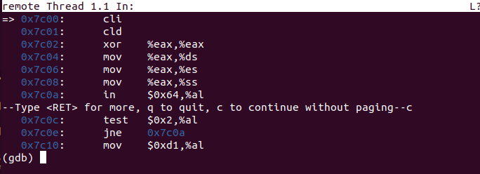

## 操作系统实验Lab1——系统软件启动过程

###### 孙天琦和孙天琦的男妈妈们

 ### 练习一 通过make生成执行文件的过程

1. 操作系统镜像文件ucore.img的分析过程

   首先我们需要找到创建ucore.img的makefile代码

   

   将ucore.img传入totarget表达式调用call函数结果赋值给UCOREIMG变量，然后UCOREIMG作为target，其首先依赖于kernel和bootblock两个文件，接下来是make的指令。首先从/dev/zero（/dev/zero是类UNIX系统中的一个特殊的组件，如果你读它，它会提供给你无限的空字符）中读取了10000个块的文件，每个块默认用0填充的512字节，生成空文件，接着将bootblock中的内容写到第一个块中，将kernel的内容写到第二个块中

   不难发现，如果生成ucore.img需要首先生成kernel和bootblock，因此我们需要观察kernel和bootblock

   查看kernel的makefile代码

   

   kernel的生成依赖于KOBJS和tools/kernel.ld，第五行链接各种文件输出给目标文件，第六行反汇编输出给asmfile这个变量，第七行输出目标文件的行号并进行文本替换，最后写入symfile这个变量

   使用make V= > build.log 2>&1将makefile的过程具体输出到日志文件build.log中（过长未截全）

   

   

   ld命令根据链接脚本文件kernel.ld将生成的*.o文件，链接成BIN目录下的kernel文件；-m指定特定的链接器，-T指定文件名，-o指定输出文件的名称

   生成kernel需要很多文件，生成这些文件的makefile为下列的批处理代码

   

   实际代码为，以init.o为例

   

   -fno-bultin 除非用builtin前缀，否则不进行builtin优化

   -ggdb 尽可能的生成gdb可用的调试信息

   -m32 生成适用于32位的代码

   -gstabs 以stabs格式生成调试信息，但是不包括gdb

   -nostdinc 使得编译器不在系统缺省的头文件目录中找头文件

   -fno-stack-protector 不生成用于检测缓冲区溢出的代码

   -I<dir> 添加搜索头文件的路径

   查看bootblock的makefile代码

   

   bootblock依赖于bootasm.o，bootmain.o，sign，生成的编译指令为

   

   -N 设置代码段和数据段均可读写

   -e 指定入口为start

   -Ttext 指定代码段开始位置为0x7C00

   bootasm.o和bootmain.o由makefile中第一行和第二行可以生成，实际代码为

   

   查看sign的makefile代码

   

   

2. 一个被系统认为是符合规范的硬盘主引导扇区的特征

   

   主引导扇区中共有512个字节，其中第511个写入0x55，第512个写入0xAA

### 练习二 使用qemu执行并调试lab1中的软件

1. 从CPU加电后执行的第一条指令开始，单步跟踪BIOS的执行

   在makefile中找到debug的命令

   

   这三行指令分别执行：

   1. 使用qemu运行一个32位程序的虚拟机，qemu在上面已经赋值过，使用到的一些变量的定义分别为：-S 在启动时不启动CPU，需要在monitor中输入c，才能让qemu继续模拟工作；-s等待gdb连接到端口1234；-hda $<，使用$<作为硬盘0 1 2 3镜像，其中$<是第一个依赖，也就是$(UCOREIMG)；-parallel stdio：重定向虚拟并口到主机设备studio中；-serial null；不重定向虚拟串口到主机设备

      

   2. sleep 2：程序休眠两秒

   3. 以gdb的方式，打开一个终端，其中使用tools/gdbinit作为初始化配置

   4. 总而言之就是启动qemu、启动terminal并运行gdb，因此我们可以修改debug代码，即在调试时增加-d in_asm -D q.log参数，将运行的汇编执行保存在/bin/q.log中

      

   修改tools/gdbinit内容为下，同时删除continue，为了防止qemu在gdb连接后立即开始执行，加入钩子，也就是gdb每次停止的时候会执行中间的语句，因为我的虚拟机中好像不太成功，所以查阅附录得到执行位置是由pc和cs寄存器计算得来，所以构造钩子

   

   make debug得到结果

   

   发现CPU加电后第一条指令为ljmp的长跳转指令，也就是说第一条指令就是0xfe05b位置的指令，si单步执行后得到下一条指令为

   

2. 在初始化位置0x7c00设置实地址断点，测试断电正常

   输入 b *0x7c00设定实地址断电，c执行，然后x /10i $pc输出10句汇编，说明断点正常（我也不知道为啥到了这里pc就能用了，离谱）

   

3. 从0x7c00开始跟踪代码运行，将单步跟踪反汇编得到的代码与bootasm.S和bootblock.asm进行比较

   bootasm.S和bootblock.asm代码基本上完全相同，主要功能就是初始化数据段、额外段、栈区等；进行与早期PC兼容的操作，如果地址线超过总线长，高位清零；从实模式切换到保护模式，使得物理地址表示转换为虚拟地址表示

4. 自己找一个bootloader或内核中的代码位置，设置断点并进行测试

   不妨把断点放到bootmain 0x7d11上，然后可以si单步查看汇编代码

   

   

5. 坑！坑！

   1. 第一小题中debug需要图形化界面，因此无法使用WSL配合VSCODE进行编程，这样的Ubuntu没有图形化界面，需要在VM的虚拟机上进行操作
   2. 灵异事件，当我进入到gdb后，x /2i $pc 并无法显示当前的汇编指令（一个长跳转），但是当我下断点之后，再用pc去看，他就能输出了，所以在执行第一条指令时我用pc和cs寄存器计算输出当前的指令 x /i (($cs << 4) + $pc)
   3. 

### 练习三 分析bootloader进入保护模式的过程


###练习四

分析 bootloader 加载 ELF 格式的 OS 的过程

在练习三中已经知道，bootasm.S文件实现了开启A20，初始化GDT表，进入保护模式 的功能。查阅资料可知这一阶段实现的功能主要是 检测系统内存映射 将内核映像和根文件系统映像从Flash读到RAM 为内核设置启动参数 最终调用内核

####4.1 bootloader如何读取硬盘扇区的？

读取硬盘扇区的操作在bootmain.c中相关的部分代码如下   对其进行分析并加以注释

 * ```
  static void
  waitdisk(void) {
      while ((inb(0x1F7) & 0xC0) != 0x40)   //不断检查IO地址0x1F7的状态，判断硬盘是否空闲
          /* do nothing */;
  }//等待硬盘盘空闲 
  
  /* readsect - read a single sector at @secno into @dst */
  static void
  readsect(void *dst, uint32_t secno) {
      // wait for disk to be ready
      waitdisk();
  
  outb(0x1F2, 1);                    // count = 1  IO地址0x1f2 功能:要读写的扇区数为1
  
  outb(0x1F3, secno & 0xFF);          
  outb(0x1F4, (secno >> 8) & 0xFF);     
  outb(0x1F5, (secno >> 16) & 0xFF);    
  outb(0x1F6, ((secno >> 24) & 0xF) | 0xE0); 
  //以上四行代码为LBA模式下传入的参数  (读取该扇区)
  outb(0x1F7, 0x20);                      // cmd 0x20 - read sectors
  //读取扇区 
  // wait for disk to be ready
  waitdisk();
  //等待硬盘空闲
  // read a sector
  insl(0x1F0, dst, SECTSIZE / 4);
  //用inline 函数 isnl(uint32_t port, void *addr, int cnt)实现
  //从0x1f0开始读取，总字节数为SECTSIZE字节数，一直读取到dst位置,每次读四个字节，共SECTSIZE/4次
  }
  
  ```

  根据以上代码分析可知，bootloader读取硬盘扇区的过程如下

  1.等待硬盘空闲：调用waitdisk()函数，不断检查IO地址0x1F7的状态，判断硬盘是否空闲

  2.硬盘空闲时调用outb()函数描述所要读取扇区，并发出读取扇区的指令

  3.再次等待硬盘空闲

  4.硬盘再次空闲时调用内联函数insl，从0x1f0开始读取，总字节数为SECTSIZE字节数，一直读取到dst位置,每次读四个字节，共SECTSIZE/4次

####4.2 bootloader是如何加载ELF格式的OS？

#####(1) readseg函数

readseg函数代码如下  对其进行分析和注释 

```
static void
readseg(uintptr_t va, uint32_t count, uint32_t offset) {
    uintptr_t end_va = va + count;   //end_va设置为所要读取的地址的尾部

    // round down to sector boundary   （向下舍入到扇区边界）
    va -= offset % SECTSIZE; 
    
    // translate from bytes to sectors; kernel starts at sector 1 
    //（从字节转换为扇区； 内核从扇区1开始）
    uint32_t secno = (offset / SECTSIZE) + 1;
    
    // If this is too slow, we could read lots of sectors at a time.
    // We'd write more to memory than asked, but it doesn't matter --
    // we load in increasing order.
    for (; va < end_va; va += SECTSIZE, secno ++) {
        readsect((void *)va, secno);
        //通过循环调用readsect函数从扇区读取数据写入va指向的内存区域
    }

}
```

#####(2)bootmain函数

```
bootmain(void) {
    // read the 1st page off disk
    readseg((uintptr_t)ELFHDR, SECTSIZE * 8, 0);

// is this a valid ELF?
if (ELFHDR->e_magic != ELF_MAGIC) {
    goto bad;
}
//读取文件头  判断是否为有效的ELF文件
struct proghdr *ph, *eph;

// load each program segment (ignores ph flags)
ph = (struct proghdr *)((uintptr_t)ELFHDR + ELFHDR->e_phoff);
//把ELF文件头中的Program header table存在ph中
eph = ph + ELFHDR->e_phnum;
//按照Program header table将ELF文件中的数据写入内存
for (; ph < eph; ph ++) {
    readseg(ph->p_va & 0xFFFFFF, ph->p_memsz, ph->p_offset);
}   //循环调用readseg  向内存写入数据

// call the entry point from the ELF header   从ELF头的入口信息找到程序入口
// note: does not return
((void (*)(void))(ELFHDR->e_entry & 0xFFFFFF))();

bad:
    outw(0x8A00, 0x8A00);
    outw(0x8A00, 0x8E00);

    /* do nothing */
    while (1);

}
```

根据以上代码分析可知，bootloader加载ELF格式的OS的过程如下

1.读取文件ELF头，判断是否为有效的ELF文件；若是，则存储其Program header地址，若不是，则go bad。

2.按照Program header table 循环调用readseg  向内存写入数据

3.根据ELF头中的入口信息，找到OS内核的入口

